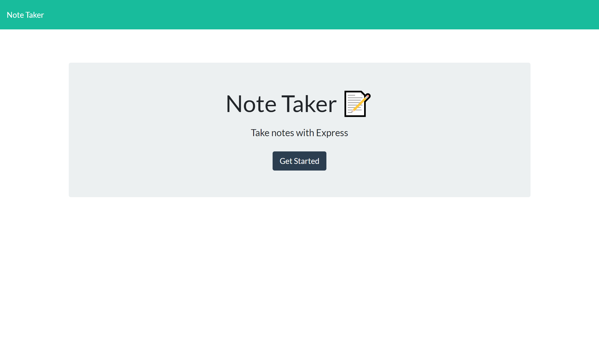
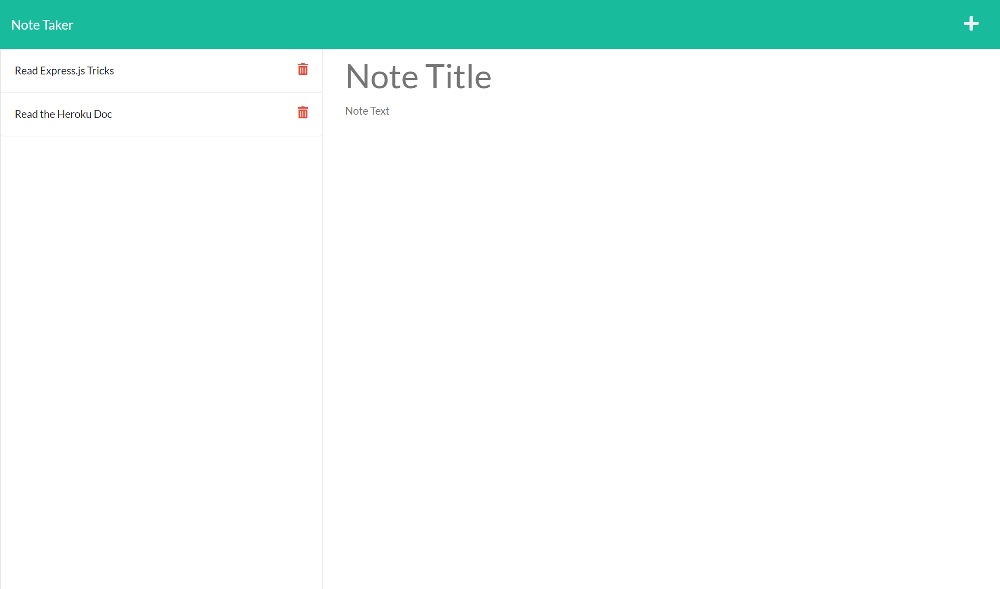

# Note Taker 

## Table of Contents

- [Description](#description)
- [Licenses](#licenses)
- [Installation](#installation)
- [Usage](#usage)
- [Technologies](#technologies)
- [Screen shots](#screen-shots)
- [Credits](#credits)
- [Contributions](#contributions)
- [Questions](#questions)


## Description : 
This a Note Taker App that runs on node and uses express.js to route all the get, post and delete methods. This app has a Front-End portion that was made using HTML, bootstrap and javascript, that will take notes and displays them.

## Licenses :
[](https://opensource.org/licenses/MIT)


[Click here to see the running Note Taker !](ldjsfs)


## Installation : 
To install the Note Taker  App use the instructions bellow &#8595;
```
npm install 
```


## Usage : 
Users can go to the deployed App on heroku and add notes. Users can add note's title and description. Users to be able to save the notes. Users can delete notes. 

## Technologies : 

- HTML.
-  Bootstrap.
-  JavaScript.
-  Node.js.
-  Express.js.
-  FS Node.js module.
-  Promisify Node.js module.
-  Heroku.


## Screen shots : 
### Here are screen shots of my deployed Note Taker  App!


## Credits :

- [Muiasar-Al-Ani](https://github.com/Muiasar-Al-Ani)


## Contributions :
    Contributions, issues, and feature requests are welcome!
    Give a ⭐️ if you like this project!


## Questions : 
If you have any Question please feel free to contact me:
- muiasar2012@gmail.com
- [Muiasar-Al-Ani](https://github.com/Muiasar-Al-Ani)


&copy; 2021 [Note Taker ](https://github.com/Muiasar-Al-Ani)
